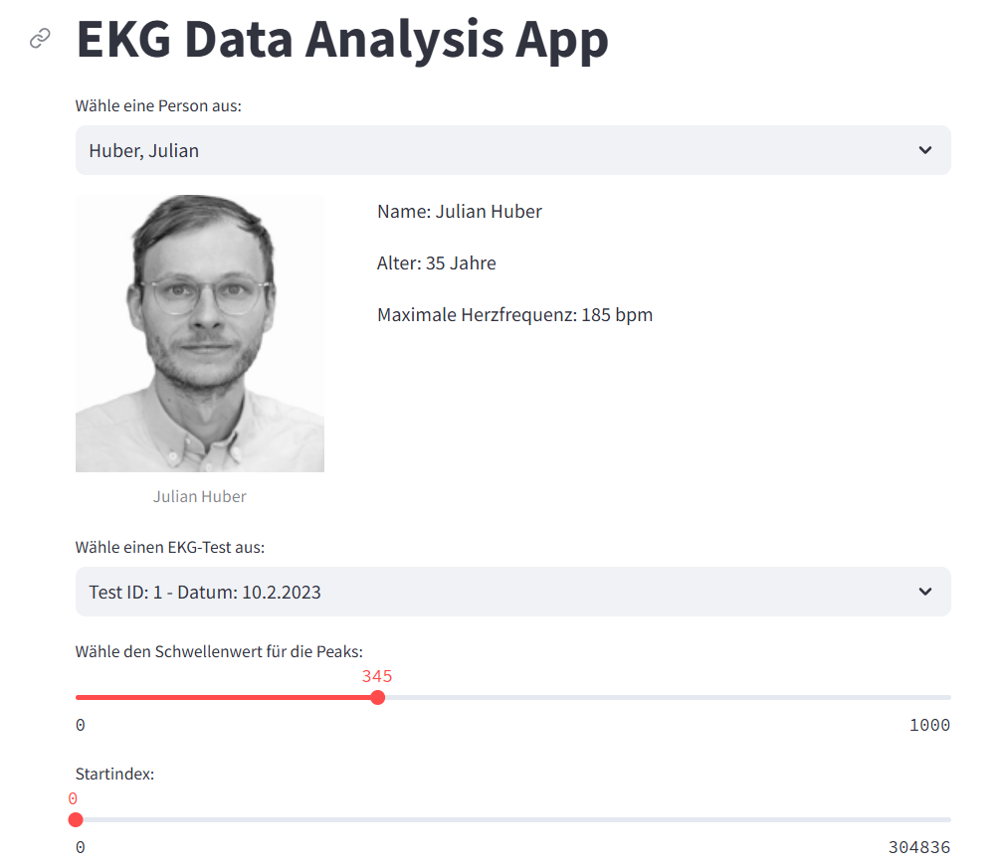
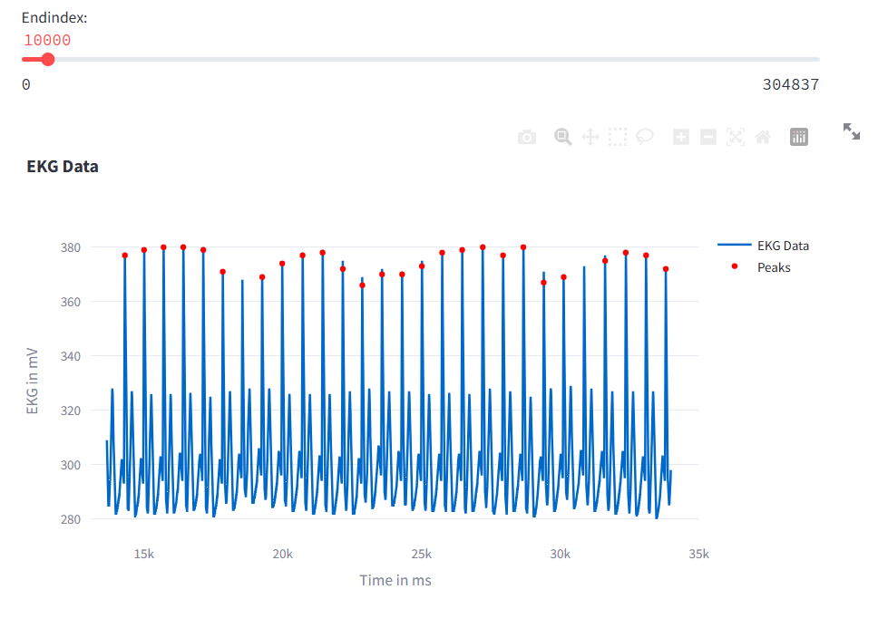
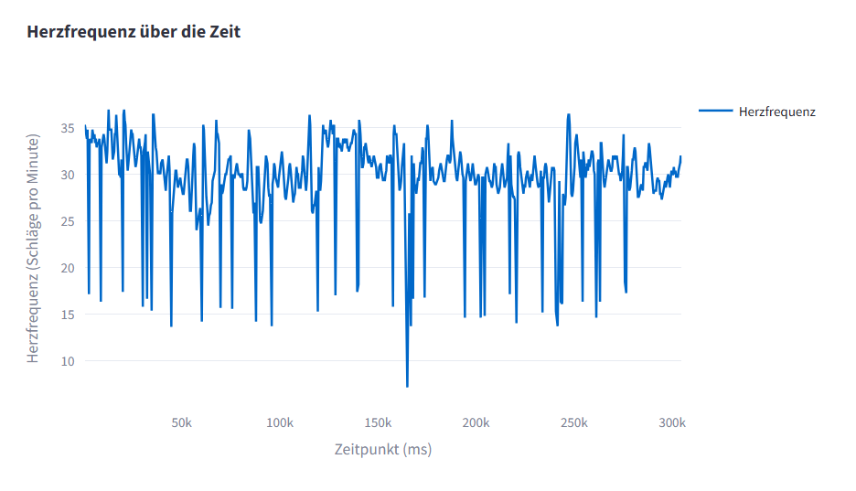

# Aufgabe 5 - Objektorientierung

## 

Diese Streamlit-App ermöglicht es Benutzern, EKG-Daten von verschiedenen Personen zu analysieren. Die App bietet Funktionen zum Anzeigen von Personendaten, zum Auswählen und Visualisieren von EKG-Tests, zur Erkennung von Peaks in den EKG-Daten und zur Berechnung der Herzfrequenz.

## Installation
Klone das Repository auf deinem Computer, indem du einen Ordner erstellst und mit cd "dein Speicherort" in diesen navigierst. 
Klone das Repository in Git Bash mit git clone https://github.com/JuleTrotzki/Aufgabe3-5/tree/main/Aufgabe5
Öffne nun deinen erstellten Ordner in Visual Studio Code.

## Einrichtung der virtuellen Umgebung

Zunächst müssen Sie die virtuelle Umgebung erstellen und aktivieren:
python -m venv .venv

Für Unix/Linux:
source venv/bin/activate

Für Windows:
.\.venv\Scripts\activate

## Abhängigkeiten installieren
Öffne eine Befehlszeile, navigiere zum Projektordner und führe den folgenden Befehl aus, um die erforderlichen Abhängigkeiten zu installieren:

pip install -r requirements.txt

## Verwendung
Öffne eine Befehlszeile, navigiere zum Projektordner und führe den folgenden Befehl aus, um das Programm auszuführen:

streamlit run main.py

Wählen Sie eine Person aus der Dropdown-Liste aus.
Sie sehen nun die Personendaten und das Bild der Person.
Wählen Sie einen EKG-Test aus der Liste der verfügbaren Tests aus.
Passen Sie den Schwellenwert für die Peak-Erkennung und den Abschnitt der Zeit-Daten mit dem Schieberegler an. 
Zu sehen sind dann die EKG-Daten und deren Peaks, sowie die berechnete Herzfrequenz in einem interaktiven Plot.

